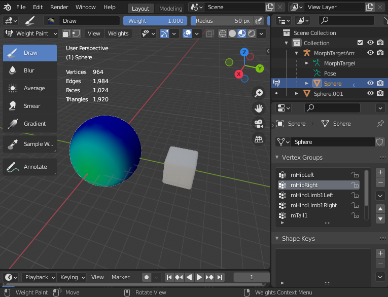
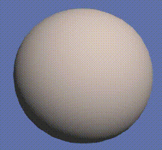

# Morph target rigging for Animesh

# Why

Some kinds of animations don't lend themselves to skeletal animation. Morph target animation
allows you to sculpt another version of the object and morph between the basis state
and the deformed state. If you just need animesh to semi-linearly morph between two arbitrary
states then this might be useful to you.

# Caveats

* Only one morph target per mesh because of how it works
* * Morph target is essentially baked into the weights!
* * Might be able to do more by alpha flipping faces.
* Normals will not morph, so shading may be slightly off for major deforms
* * Might be able to work around this with `llTextureAnim()` + normal map to offset wrong normals
* Wouldn't work well for rigged attachments unless they were meant to be hands or a head.
* Can't mix traditional skeletal animation with the morph target animation because all
  the joint influence is needed for doing the morph target animation.
* Not useful for clothing deforms as proposed in <http://wiki.secondlife.com/wiki/Morph_Target_Community_Proposal>.
* Not well-supported, annoying to make animations for.

# Instructions

This is for plain Blender 2.9 without Avastar. I don't know if it works with Avastar.
A completed example is in `examples/testcube-for-edit.dae`.

1. Install the `blender_sl_morph_target_rigging.py` plugin in Blender 2.9+.
2. Duplicate the object you want to morph
3. Modify it somehow. Sculpt it, scale it, whatever. Just make sure you apply any scale transforms
   or modifiers when you're done.
4. * Optionally, to preview how the morph will look, shift-select the morphed object then the original
   * Go to Object Data -> Shape Keys -> Shape Key Specials -> Join as Shapes
   * Click the added shape key and drag the value slider around to see how the morph will look.
     Make sure you set the slider back to `0` when you're done.
5. Shift-select the morphed object, then the original, and go into Weight Paint mode
6. Click `Weights -> Morph Target to SL Weights`. Your object will be automatically weight painted
   and vertex groups will be added for the control joints that morph target animation uses.
7. Import `morph-target-armature.dae` and parent your weighted base mesh to the armature with armature deform.
8. Make sure only your base mesh is selected then click `File -> Export -> Collada`, choosing "sl + opensim rigged"
   under "Operator Presets" and save.
9. Import to SL with rigging + joint positions
10. Upload one of the morphing animations in the `animations` directory and play it with an animesh script.

# How does it work

With 6 joints that only move in one specific direction, 2 for each axis. Weight influence is
assigned to vertices according to the direction and distance of their morphed version.

By creating animations that move these joints around with SL's animation system, we can morph
the vertices into their final position.

For example, any vertex that needs to move along +X will be weighted to mHipLeft, and its
animations will only move it along +X. Once mHipLeft reaches `<5, 0, 0>` the object will be
fully morphed along the +X axis.

# Creating animations to control morphing

There's not a nice way to do this right now, I generate mine with scripts like the included
`make_morph_anim.py`. You might be able to import some of the example `.anim`s into Avastar
and fiddle with them, but I don't know how that would work.

# License

The Python code is licensed under the GPL v3, same as the rest of the repo. You may use the
code in your own Blender addons as long as they are GPL v3 compliant.

The example Collada files and animations are either public domain or CC0, at your preference.
